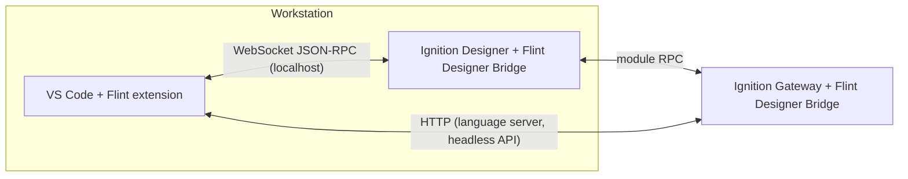

# Flint

Flint brings real IDE workflows to Ignition SCADA/HMI development. Instead of editing every script and view inside the Designer, you work on your Ignition project files in VS Code — with a project-aware browser, Jython language intelligence, a breakpoint debugger, and live tools that reach into a running Designer and gateway.

Flint is two open-source components (both MIT licensed):

| Component | What it is | Where to get it |
|---|---|---|
| **Flint for Ignition** | VS Code extension (`Keith-gamble.ignition-flint`) | [VS Code Marketplace](https://marketplace.visualstudio.com/items?itemName=Keith-gamble.ignition-flint) |
| **Flint Designer Bridge** | Ignition module (`dev.bwdesigngroup.flint.FlintDesignerBridge`) | [GitHub Releases](https://github.com/bw-design-group/flint-designer-bridge-ignition-module/releases) |

The extension is useful on its own for browsing, editing, and searching project files. Installing the Designer Bridge module unlocks the connected features: gateway-backed language intelligence, the debugger, the Script Console, the live Tag Browser, and Perspective profiling.

<!-- SCREENSHOT: VS Code with the Flint Project Browser open, a decoded Perspective script in the editor, and the status bar showing a connected Designer -->

## What Flint can do

### Edit

- **[Project Browser](/features/project-browser)** — browse gateways, projects, and resources (scripts, named queries, Perspective views, style classes, session config) as a typed tree, including inherited resources from parent projects.
- **[Resource operations](/features/resources)** — create, rename, duplicate, and delete resources with correct `resource.json` metadata, validated against templates.
- **[Embedded-script editing](/features/embedded-scripts)** — decode a Jython script embedded in a resource JSON file into a real Python editor tab; saving re-encodes it in place. Includes [Git merge-conflict helpers](/features/git-merge-conflicts) for script fields.
- **[Search](/features/search)** — resource-name and full-text search across all configured projects, with regex support and jump-to-line results.

### Language intelligence

- **[Gateway-backed Jython LSP](/language/gateway-lsp)** — completion, hover, go-to-definition, find references, syntax diagnostics, and document/workspace symbols for Python 2.7 project scripts, powered by a language server running inside the gateway. `system.*` completions come from the live gateway, so they match your installed modules. No Designer required.
- **[Completion fallbacks](/language/completion)** and **[Ignition API stubs](/language/ignition-stubs)** for offline work.

### Debug

- **[Breakpoint debugger](/debugging/debugger)** — a native VS Code debugger (launch type `flint`) that runs scripts in the real Designer, Gateway, or Perspective Jython interpreter with line and conditional breakpoints, stepping, call stacks, variable inspection, and expression evaluation. See [limitations](/debugging/limitations).
- **[Script Console](/debugging/script-console)** — a live Jython REPL inside VS Code against Designer, Gateway, or Perspective scopes, with persistent session state.

### Live tools

- **[Tag Browser](/live-tools/tag-browser)** — browse providers, tags, and UDTs with live values and quality; read, write, create, edit, and delete tags from VS Code.
- **[Perspective profiling](/live-tools/perspective-profiling)** — static view analysis plus live view and page binding metrics from a running session.
- **[Designer navigation](/live-tools/designer-navigation)** — open a resource in the Designer directly from the VS Code tree.

### Automation

- **[Headless gateway API](/module/headless-api)** — the module exposes an authenticated HTTP JSON-RPC endpoint (`/data/flint/rpc`) on the gateway, offering script execution, tag/UDT/view operations, and the full language server with no Designer running. See the [JSON-RPC reference](/module/json-rpc-reference) and [security model](/module/security).

## Architecture

The extension talks to a running Designer over a localhost WebSocket (debugging, Script Console, Tag Browser, Perspective tools), and the Designer relays gateway-scope operations to the gateway. Independently, the extension's language server and the headless API talk to the gateway directly over HTTP with an API token — no Designer needed for those.

## Connectivity tiers

:::info Prerequisites
Flint features fall into three tiers. Each feature page states which tier it needs.

| Tier | What it needs | Example features |
|---|---|---|
| **Works offline** | Project files on disk + `flint.config.json` | Project Browser, resource operations, search, embedded-script decode, static view analysis |
| **Gateway + API token** | Reachable gateway with the Designer Bridge module installed | Jython LSP (completion, hover, definition, references, diagnostics), headless API |
| **Designer Bridge + running Designer** | Module installed and a Designer open on the same machine | Debugger, Script Console, Tag Browser, live Perspective profiling |
:::

## Supported versions

| Requirement | Version |
|---|---|
| VS Code | 1.102 or later |
| Ignition (8.1 line) | 8.1.44 or later — install `Flint-Designer-Bridge-<version>-8.1.modl` |
| Ignition (8.3 line) | 8.3.1 or later — install `Flint-Designer-Bridge-<version>-8.3.modl` |

Module releases ship one artifact per Ignition major line; install the one that matches your gateway. See [Module installation](/module/installation).

<!-- SCREENSHOT: Flint Setup Wizard webview on first launch -->

## Get started

1. **[Installation](/getting-started/installation)** — install the extension and the Designer Bridge module.
2. **[Quick start](/getting-started/quick-start)** — run the Setup Wizard and browse your first project.
3. **[Connecting a Designer](/getting-started/connecting-designer)** — launch the Designer and let Flint auto-discover it.

If something does not behave as expected, see [Troubleshooting](/troubleshooting).
