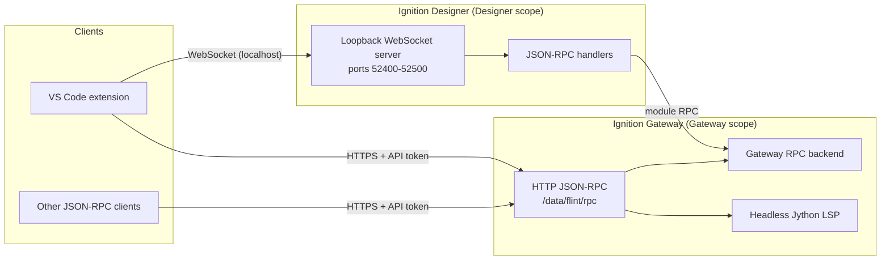

The Flint Designer Bridge is an Ignition module that lets external tools — the [Flint VS Code extension](/getting-started/installation) and other JSON-RPC clients — talk to a running Ignition Designer and to the gateway itself. It turns the Designer into a live automation target (script execution, view editing, tag operations, debugging) and gives the gateway a headless API that works with no Designer open at all.

The module is free, Maker Edition compatible, MIT licensed, and requires no license activation.

:::info Prerequisites
This section documents the module itself. To use any bridge-backed feature you need the Designer Bridge module installed on your gateway; Designer-connected features additionally need a running Designer, and headless features need a gateway API token. See [Module Installation](/module/installation) and [Security](/module/security).
:::

## Module facts

| Property | Value |
|---|---|
| Module ID | `dev.bwdesigngroup.flint.FlintDesignerBridge` |
| Display name | Flint Designer Bridge |
| Scopes | Gateway, Designer, Common |
| Artifacts | `Flint-Designer-Bridge-<version>-8.1.modl` (Ignition 8.1.44+), `Flint-Designer-Bridge-<version>-8.3.modl` (Ignition 8.3.1+) |
| Downloads | [GitHub releases](https://github.com/bw-design-group/flint-designer-bridge-ignition-module/releases) |
| License | MIT, free module, Maker-compatible |
| Signed | Yes |
| Gateway config pages | None — configuration is file- and property-based only |

:::warning One artifact per Ignition major line
Each release ships two `.modl` files. Install the `-8.1` artifact on Ignition 8.1.44+ gateways and the `-8.3` artifact on Ignition 8.3.1+ gateways — they are not interchangeable. If you are upgrading from module v0.13.x or earlier, uninstall the old `com.bwdesigngroup.flint-designer-bridge` module first; the module ID changed in v1.0.0.
:::

## Three scopes, three jobs

| Scope | Runs in | Responsibility |
|---|---|---|
| Common | Designer and Gateway | JSON-RPC 2.0 wire types, method registry and constants, the Designer↔Gateway RPC interface, shared authentication utilities |
| Designer | Each Designer session | A loopback-only WebSocket server per Designer, a discovery registry file, per-capability JSON-RPC handlers, and a script-change detector that pushes notifications to connected clients |
| Gateway | The gateway JVM | The RPC backend for Designer-initiated gateway operations, plus a standalone headless HTTP JSON-RPC endpoint and the full headless Jython language server |

## Two transports

The bridge exposes the same JSON-RPC 2.0 protocol over two transports:

1. **Per-Designer loopback WebSocket** — each running Designer opens a WebSocket server bound to localhost on a port in the range **52400–52500**. Clients discover instances through registry files in `~/.ignition/flint/designers/` and authenticate with a per-instance secret. This is the transport the VS Code extension uses for Designer-connected features.
2. **Gateway HTTP JSON-RPC** — `POST /data/flint/rpc` on the gateway (with a public `GET /data/flint/health` check). It is wire-compatible with the Designer WebSocket and requires no Designer at all, making it suitable for CI, headless tooling, and AI agents. See [Headless API](/module/headless-api).

<!-- SCREENSHOT: Gateway module configuration page showing Flint Designer Bridge installed and running -->

## Capabilities by group

| Group | Designer WebSocket | Gateway HTTP | Notes |
|---|---|---|---|
| Script execution | Yes (Designer scope, persistent session variables) | Yes (gateway scope) | Plus Perspective session script execution in both |
| Project and view CRUD | Yes | Yes | `project.listResources`, view catalog, full `view.*` get/set/create/delete/save/validate |
| Tags and UDTs | Yes | Yes | Browse, read, write, create, edit, delete tags; UDT definitions and instances |
| Perspective | Yes | Yes | Session/page/view inspection, component completions, view profiling, event recording |
| Debugging | Yes | Yes | Real breakpoint debugger: conditional breakpoints, stepping, stack frames, variable inspection, evaluate. See [Debugger](/debugging/debugger) |
| Language server (LSP) | Completion only | Full | Gateway HTTP adds diagnostics, hover, definition, references, and symbols. See [Gateway LSP](/language/gateway-lsp) |
| Component schema and icons | Yes | Yes | Component registry lookup, icon list and search |
| Designer navigation | Yes | Yes | Open resources, list open tabs, toggle preview mode |

:::warning Designer WebSocket LSP is completion-only
Over the Designer WebSocket, the language surface supports code completion only — hover, go-to-definition, references, diagnostics, and symbols are provided exclusively by the gateway's headless language server over HTTP.
:::

## Perspective dependency

The module declares a dependency on the Perspective module, but treats it as optional at runtime. On gateways without Perspective, the bridge loads and all non-Perspective capabilities work; Perspective-specific methods report unavailability instead of failing the module.

## Security in brief

- The Designer WebSocket binds to loopback only. Each Designer instance generates a 256-bit secret stored in an owner-only (`0600`) registry file, and every method except `authenticate` is rejected until the client authenticates.
- The gateway HTTP endpoint requires a token on every `/rpc` call: native Ignition API tokens on 8.3, or a Flint-managed bearer token on 8.1. Only `/health` is public.

:::danger Treat gateway tokens like developer credentials
A valid gateway API token can execute arbitrary gateway-scope Jython and perform resource, tag, and UDT changes. Full details, including token provisioning for containers, are in [Security](/module/security).
:::

## Where to go next

- [Module Installation](/module/installation) — installing the `.modl` on your gateway
- [Security](/module/security) — the full authentication and token model
- [Headless API](/module/headless-api) — using `/data/flint/rpc` without a Designer
- [JSON-RPC Reference](/module/json-rpc-reference) — every method, by group
